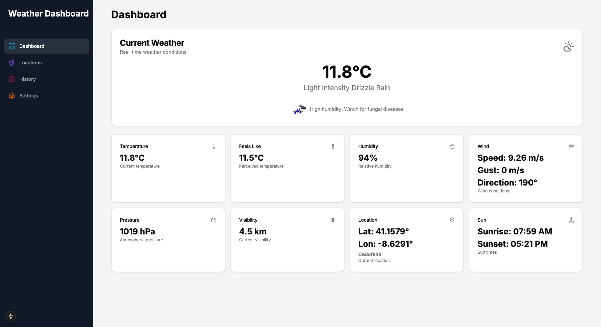
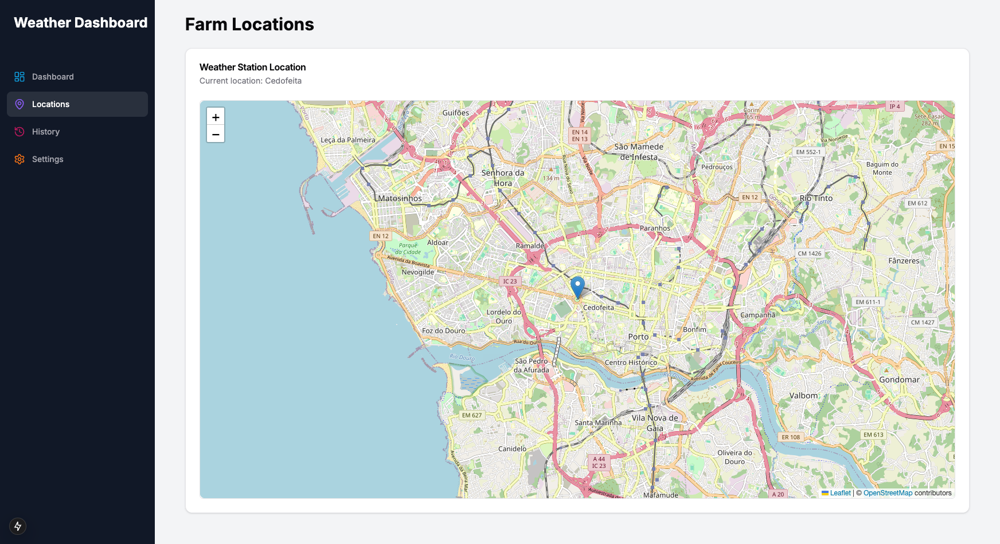
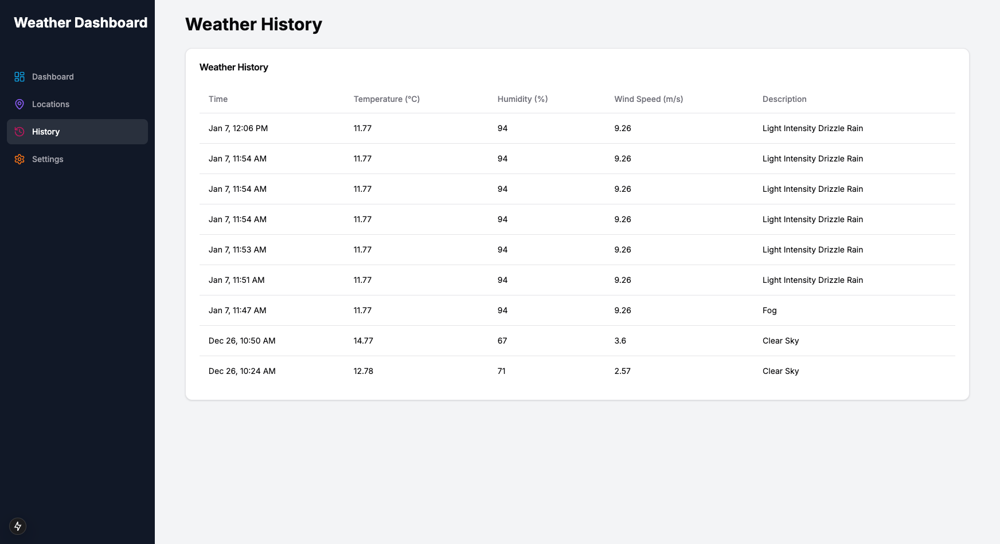
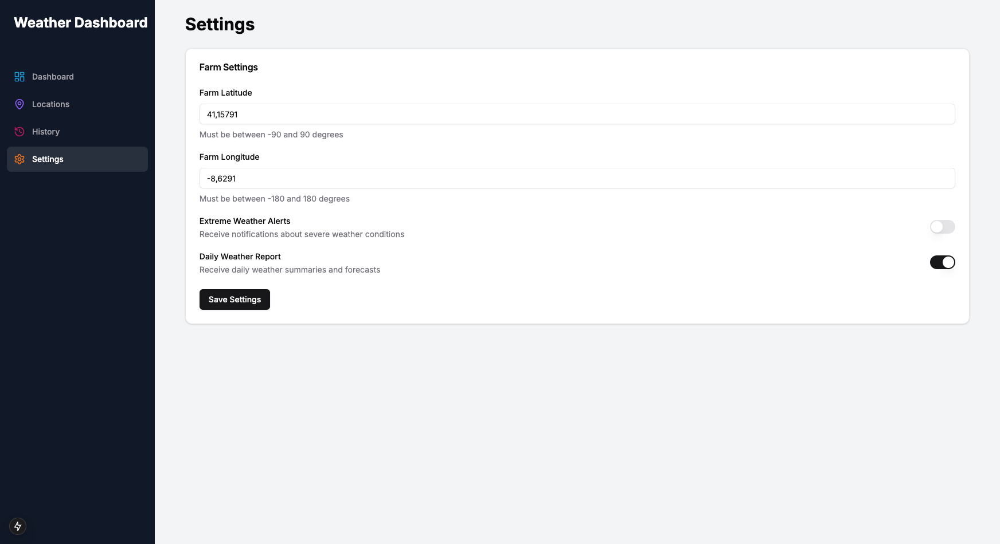

# Farm Weather Monitor

A comprehensive weather monitoring application designed specifically for farm environments, providing real-time updates, historical data analysis, and actionable recommendations for agricultural activities.






## Overview

Farm Weather Monitor is a specialised application that helps farmers and agricultural professionals make informed decisions based on weather conditions. It combines real-time weather data with historical analysis to provide valuable insights for farm management.

## Key Features

- 🌡️ Real-time weather monitoring  
- 📊 Historical weather data analysis  
- 🌱 Farm-specific weather recommendations  
- 📍 Multi-location management  
- 📱 Responsive design for all devices  
- 🔔 Weather alerts and notifications  
- 🗺️ Interactive weather maps  
- 📈 Weather trend analysis  

## Tech Stack

### Backend
- **Framework**: Python / FastAPI  
- **Database**: Appwrite  
- **API Integration**: OpenWeatherMap  
- **Authentication**: JWT  
- **Asynchronous Task Handling**: Built-in FastAPI capabilities (no Celery)  

### Frontend
- **Framework**: Next.js 13+  
- **UI Library**: Tailwind CSS  
- **State Management**: React Query  
- **Charts**: Chart.js  
- **Maps**: Leaflet.js  

### Infrastructure
- **Deployment**: Railway  
- **CI/CD**: GitHub Actions  
- **Monitoring**: Sentry  
- **Cache**: Redis (optional)  

## Project Structure


```
weather/
├── backend/               # FastAPI backend
│   ├── __init__.py
│   ├── .env               # Environment variables
│   ├── config.py          # Settings and configuration
│   ├── main.py            # Entry point for the FastAPI app
│   ├── models.py          # Pydantic and DB models
│   ├── routers.py         # API route handlers
│   ├── services.py        # Business logic
│   └── requirements.txt   # Python dependencies
│
└── frontend/              # Next.js frontend
    ├── src/            
    │   ├── components/    # Reusable UI components
    │   ├── pages/         # Next.js pages
    │   ├── styles/        # CSS and styling
    │   └── utils/         # Helper functions
    ├── public/            # Static files
    └── package.json       # Node.js dependencies
```

## Prerequisites

- Python 3.9+
- Node.js 16+
- OpenWeatherMap API key
- Appwrite account and setup
- Git
- Redis (optional)

## Installation and Setup

### Backend Setup

1. Clone the repository:
```bash
git clone https://github.com/adelino-masioli/farm-weather-monitor.git
cd farm-weather-monitor
```

2. Navigate to the backend directory:
```bash
cd backend
```

3. Create and activate virtual environment:
```bash
python -m venv venv
source venv/bin/activate  # On Windows: venv\Scripts\activate
```

4. Install dependencies:
```bash
pip install -r requirements.txt
```

5. Set up environment variables:
```bash
cp .env.example .env
```

6. Run the backend server:
```bash
uvicorn backend.main:app --reload --host 0.0.0.0 --port 8000
```

### Frontend Setup

1. Navigate to the frontend directory:
```bash
cd frontend
```

2. Install dependencies:
```bash
npm install
# or
yarn install
```

3. Set up environment variables:
```bash
cp .env.example .env.local
```

4. Run the development server:
```bash
npm run dev
# or
yarn dev
```

## Environment Variables

### Backend (.env)
```
OPENWEATHERMAP_API_KEY=your_openweathermap_api_key
APPWRITE_ENDPOINT=https://your_appwrite_instance_or_cloud.appwrite.io/v1 # Example
APPWRITE_PROJECT_ID=your_project_id
APPWRITE_DATABASE_ID=your_database_id
APPWRITE_API_KEY=your_server_side_appwrite_api_key # Secret key
APPWRITE_COLLECTION_ID=your_weather_data_collection_id
APPWRITE_COLLECTION_SETTINGS_ID=your_settings_collection_id
APPWRITE_SETTINGS_DOCUMENT_ID=your_fixed_settings_document_id
# APPWRITE_RECOMMENDATIONS_COLLECTION_ID=weather_recommendations # Optional, has default
PORT=8000 # Optional, defaults to 8000 in config.py

# Optional: Default location and settings (can also be managed via API)
# DEFAULT_FARM_LATITUDE=41.1579
# DEFAULT_FARM_LONGITUDE=-8.6291
# DEFAULT_UNITS="metric"
# DEFAULT_UPDATE_FREQUENCY=30
```

### Frontend (.env.local)
```
NEXT_PUBLIC_API_URL=http://localhost:8000/api # Adjust if your backend runs elsewhere or if paths differ
# NEXT_PUBLIC_API_SETTINGS_URL=http://localhost:8000 # Used in SettingsForm, points to API root
```

## API Documentation

The API documentation is available at `/api/docs` when running the backend server. It includes detailed information about all available endpoints, request/response formats, and authentication requirements.

## Contributing

We welcome contributions! Please follow these steps:

1. Fork the repository
2. Create your feature branch (`git checkout -b feature/AmazingFeature`)
3. Commit your changes (`git commit -m 'Add some AmazingFeature'`)
4. Push to the branch (`git push origin feature/AmazingFeature`)
5. Open a Pull Request

Please make sure to update tests as appropriate and follow the existing coding style.

## Deployment

The application can be deployed using Railway. Detailed deployment instructions are available in the [deployment guide](DEPLOYMENT.md).

## License

This project is licensed under the MIT License - see the [LICENSE](LICENSE) file for details.

## Support

If you encounter any problems or have questions, please:
- Open an issue
- Contact the maintainers
- Check the [FAQ](FAQ.md)

## Acknowledgments

- OpenWeatherMap for providing comprehensive weather data
- Next.js team for the excellent frontend framework
- Flask team for the robust backend framework
- The open-source community for various tools and libraries used in this project

## Changelog

See [CHANGELOG.md](CHANGELOG.md) for a list of changes and version history.

## Authors

- Adelino Masioli - [GitHub](https://github.com/adelino-masioli)
- Dharmik Savani - [GitHub](https://github.com/dharmik097)

---

Made with ❤️ for the farming community
